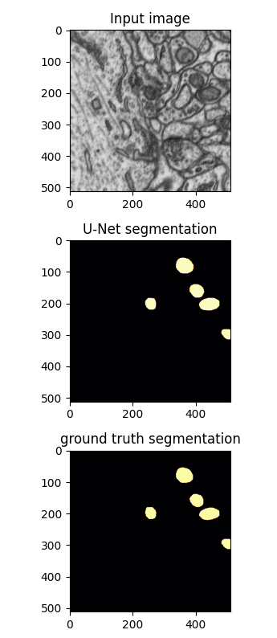

# Image segmentation demo with a U-Net style architecture



## Getting started

```
virtualenv my_env --python=python3
source my_env/bin/activate

git clone git@github.com:riveSunder/unet_demo.git
cd unet_demo
pip install -r requirements.txt
```

Download the (labeled) electron microscopy mitochondria segmentation dataset from [https://www.epfl.ch/labs/cvlab/data/data-em/](https://www.epfl.ch/labs/cvlab/data/data-em/) into folders `train`, `train_labels`, `test`, `test_labels` in the data folder. Then use the notebook `parse_data` to convert and save the tif image stacks into numpy arrays.

Modify the code as you want, then run training:

```
python unet_src/unet.py

```

